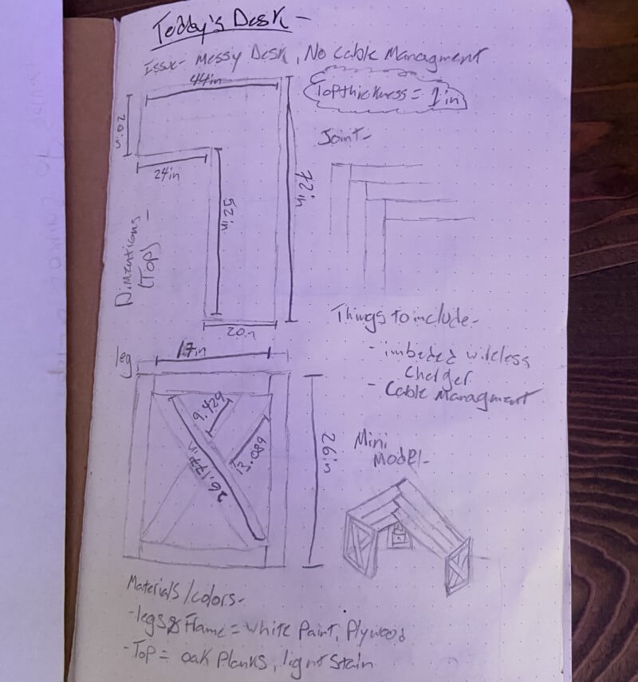
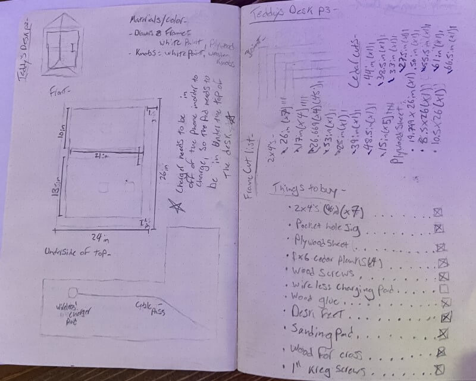
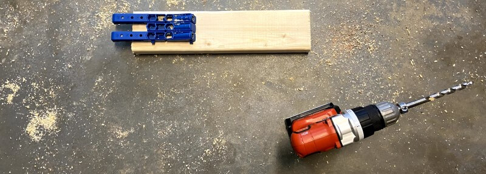
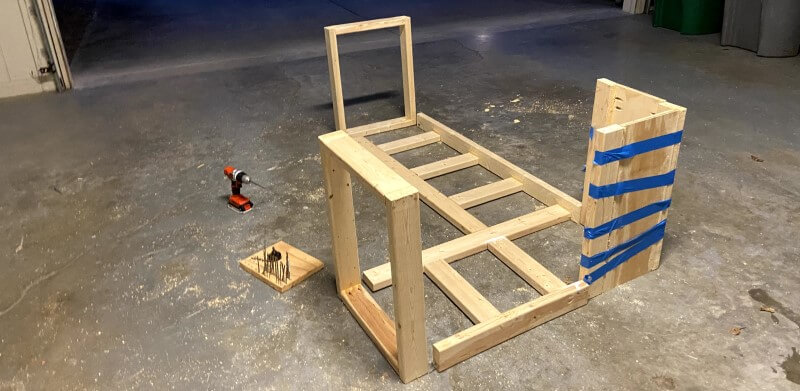
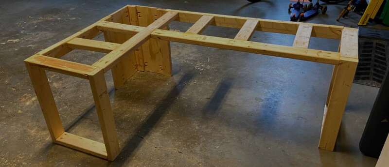
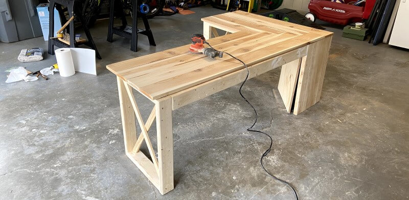
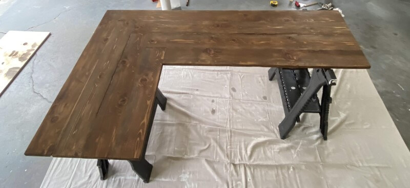
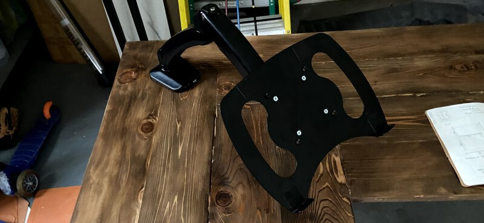
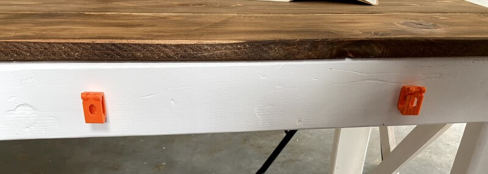
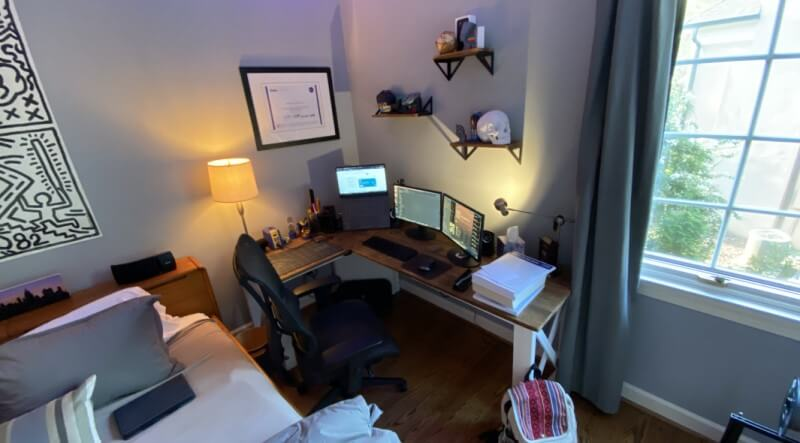

# Cable Managed Corner Desk 

Honestly this project was by far my favorite of the year, as I was able to use almost every tool that we've covered in the past two engineering courses all in one great project. At the start of 8th grade I had an issue, I was a couple months into learning Fusion360 and I decided to upgrade my setup from a old janky pc to a brand new laptop and some 20 inch monitors to go along with it, witch was great and all but gave me a whole tone of issues to sort out. I had this great desk in the corner of my room, that my great grandfather built and that had been passed down to me, however there was one huge flaw using that desk with my brand new setup and that was cable management. Below are some plans draw out for the desk.

## CAD Design

So I set off in Fusion to design a desk that fit all of my needs. My goals were to have a desk measured to fit perfectly in the corner of my room, with plenty of legroom so I would never hit my knees on it, and the best cable management Imaginatable. And after a couple different iterations, I came up with this Model.

<iframe src="https://myhub.autodesk360.com/ue2cecd93/shares/public/SH56a43QTfd62c1cd9688b189f2a177d3618?mode=embed" width="100%" height="500" allowfullscreen="true" webkitallowfullscreen="true" mozallowfullscreen="true"  frameborder="0"></iframe>

<iframe src="https://myhub.autodesk360.com/ue2cecd93/shares/public/SH56a43QTfd62c1cd968f6f9f92e8cbe6137?mode=embed" width="100%" height="500" allowfullscreen="true" webkitallowfullscreen="true" mozallowfullscreen="true"  frameborder="0"></iframe>

## Lowes Trip and New Tool

However shortly after finishing up the CAD aspect of this project, Covid-19 caused our school to resorte to online learning, cutting me of from our schools lab equipment, however I happen to have a lot of the tools we have in our lab in my own little workshop at my house, and I was pretty determined to finish the desk, so just before everything closed down I took a trip to lowes to pick up some lumber and supplies. I settled on a frame and cabinet of 2x4s and some plywood that were painted white pretty quickly, but the top too some more thought. Eventually I decided to make the top out of cedar planks that were stained with Provincial to match the stain of the floor in my room. Also at lowes i picked up a Kreg-Jig to drill pocket holes for the desk, as I didn't like the idea of screws being visible. It was my first time ever using a Kreg-Jig but it went super well as its a relatively simple jig to use.

## Building Process

A couple days after getting the wood, I finally started assembling the desk, starting by laying down the frame, making sure the front 2x4 was flat and the back was upright (to give more leg space) and I was pretty excited to get the whole thing together. Maybe a little too excited because even though you can't tell from the pictures above, I built the whole desk wrong, putting the corner on the wrong side. This was a huge setback to fix as it meant that I would have to take the entire desk apart, use wood filler on all of the newly exposed holes, and build it back up the right way. I was even considering to just leave the desk as is, and rearrange my room to match the flaw, however I wanted my desk to be perfect and that meant fixing it according to my CAD model. So I did the laborious tasks listed above, and finished the frame of the desk the right way late that night. The next day I was ready to do some more on of the desk, so I decided to start throwing together the top. I spent that whole day sawing, planing, and sanding the cedar, before I put the top together using the Kreg-Jig  the next morning. And this time I didn't make a single mistake, and I'm really happy with the result.

## Painting and Staining

I spent the next two days painting the frame with three coats of white paint, and staining the cedar with Provincial. 

<iframe width="100%" height="450" src="https://www.youtube.com/embed/Ur2js0Qi-xc" title="YouTube video player" frameborder="0" allow="accelerometer; autoplay; clipboard-write; encrypted-media; gyroscope; picture-in-picture" allowfullscreen></iframe>

<iframe width="100%" height="450" src="https://www.youtube.com/embed/ipKd49bhELs" title="YouTube video player" frameborder="0" allow="accelerometer; autoplay; clipboard-write; encrypted-media; gyroscope; picture-in-picture" allowfullscreen></iframe>

  <figcaption>Stained Desktop</figcaption>

## Assembling the Desk

As I said earlier the choice of wood for the surface of the desk took some thought, but I'm super glad I went the cedar route. Originally I was planning on using oak, but the cost scared me away to a much better smelling, and looking cedar. My only concerned with this type of wood was how much it expands and contracts. I was concerned that screwing a cedar top to my frame would just wiggle itself loose over time and cause issues. So I came up with a workaround. Instead of attaching the Cedar top directly to the frame, its held by 3d Printed mounts that allow the top to expand and contract a whole lot more without becoming loose. Im super happy I took the time to figure this one out as it's going to save me trouble with using cedar in the long run.

## Cable Managment

This is a huge part of the project as its one of the reasons I decided to even build a new desk in the first place. After attaching the top of the desk to the frame, I threw on this great air spring laptop mount that routs all of the cables from my laptop through a grommet in the top on the table, down to the corner cabinet. The cabinet is designed with false top that hides all of the cables (except for two going to the subwoofer on a lower shelf) from inside the cabinet. Then the cables are routed through a whole in the back and ran through 3d printed cable clips on the back of the desk. The cable clips are exactly as long as the trim of our floor is, so they don't push the desk off the wall anymore than it needs to be. All of the cables are then ran to where their needed (i.e monitors, speakers, keyboard, google home, ect.). Finally all of the power cables are ran back into the top of that corner cabinet and plugged into a built in power strip, witch plugs into a wall socket directly to the left of the cabinet, hiding all the cables from view.

## Final Thoughts

I really love how my desk came out, It solves all of my annoying cable issues and fits perfectly in the right corner of my room. Eventually Im planning on wall mounting my monitors give me even more desk space, however the little corner piece gives me a perfect location to use a pen and some paper and write things out. Putting the desk in its place, i realised that there was way to much empty space above it and after some browsing, I found some shelves on amazon that use the same stain and match perfectly, so i ordered and installed those over the desk. This project we surprisingly smoothly in the face of the current Pandemic, and even with my building setbacks came out really well.

  <figcaption>Final Desk Beauty Shot</figcaption>

