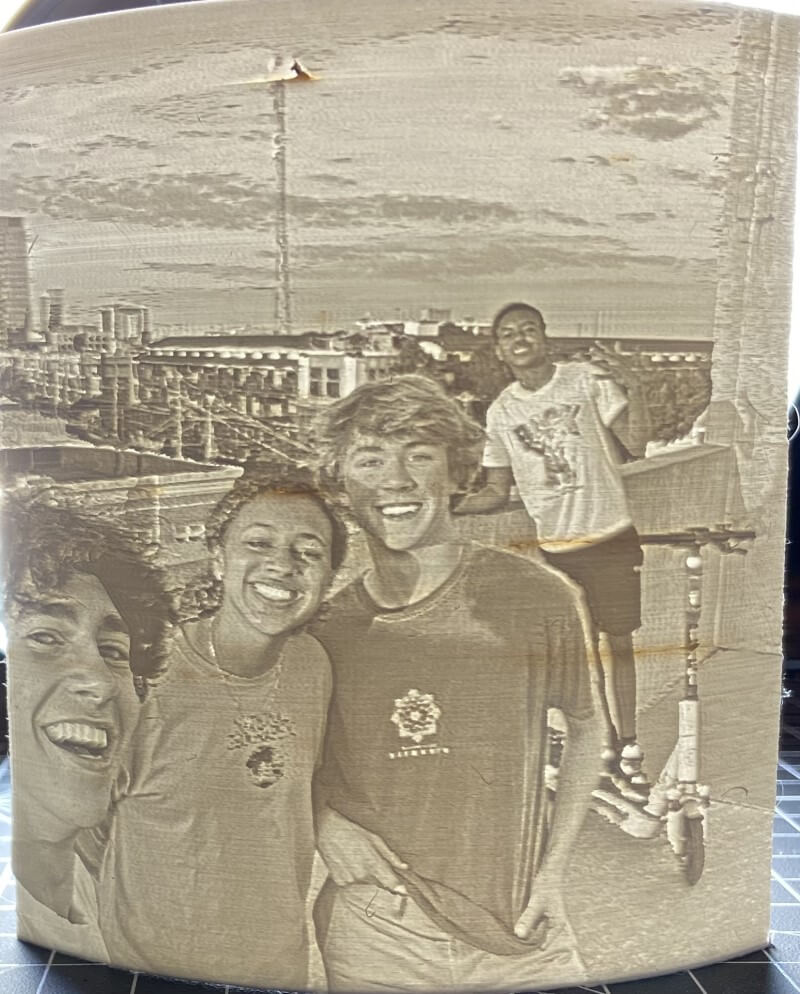
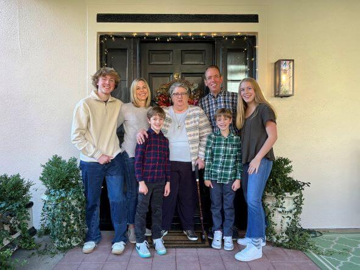
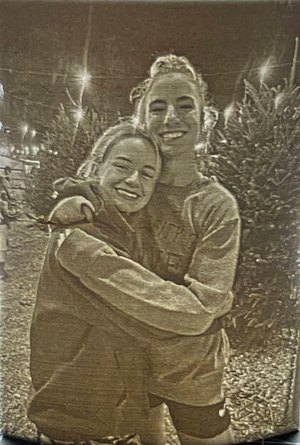
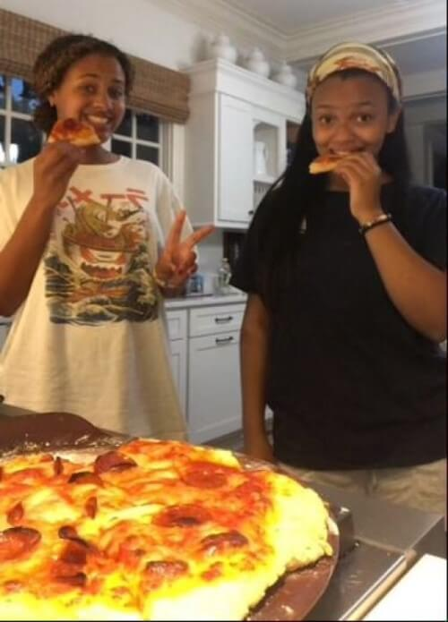
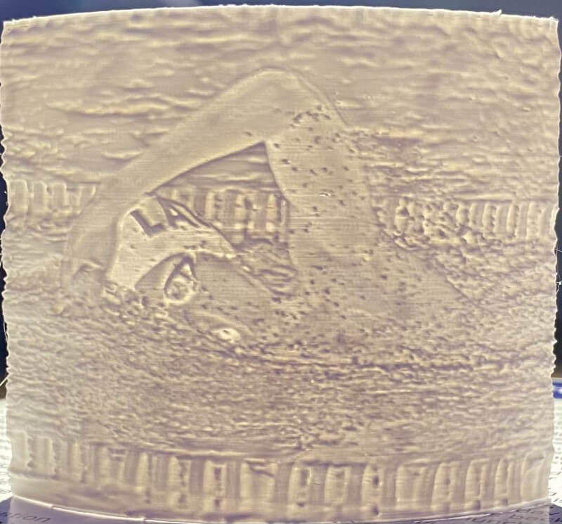
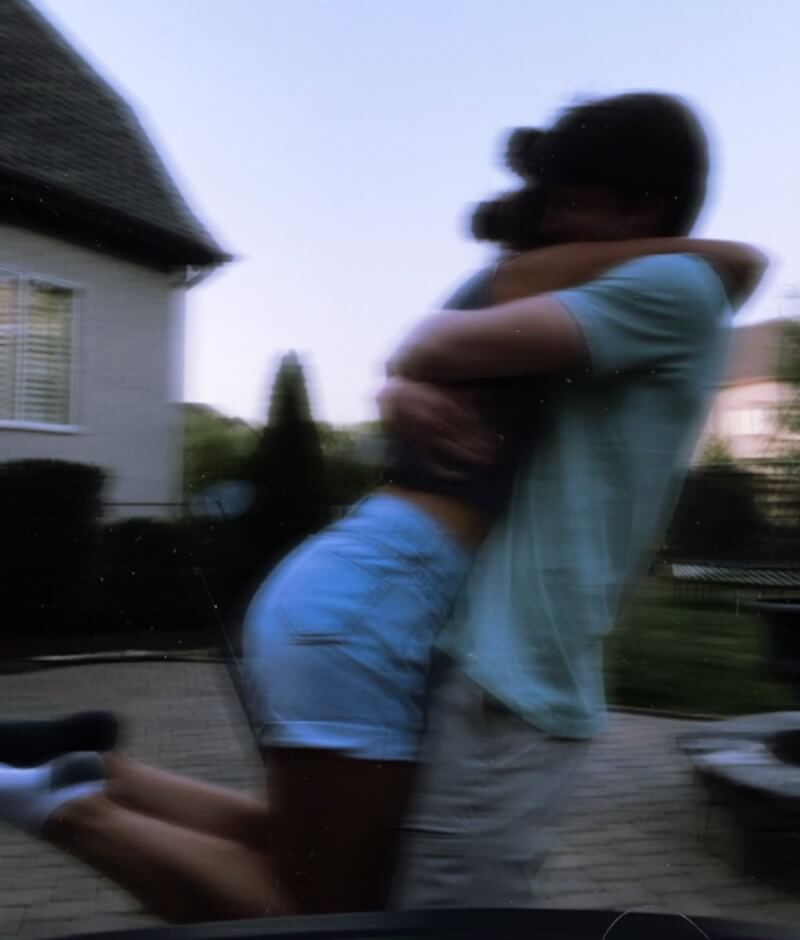
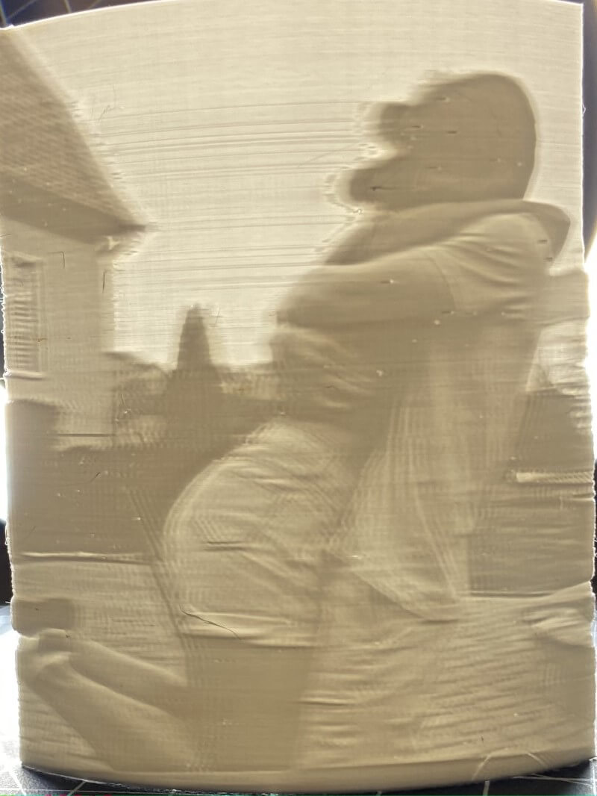
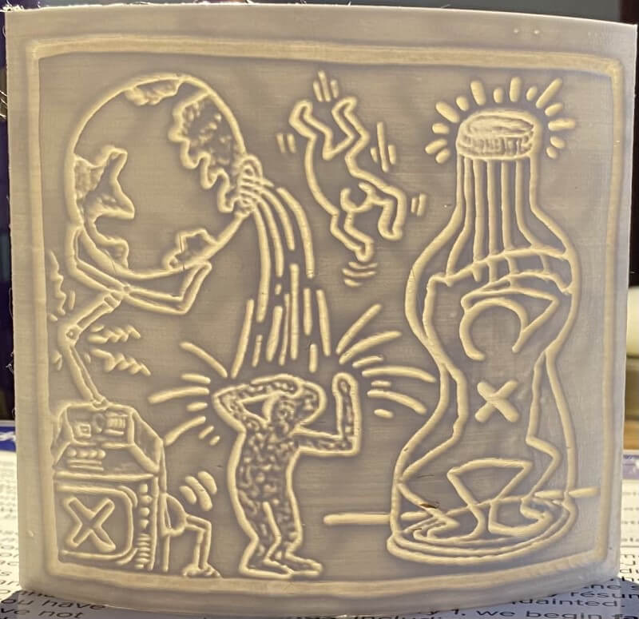
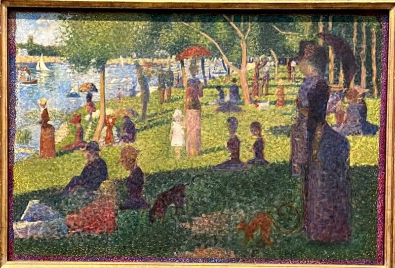
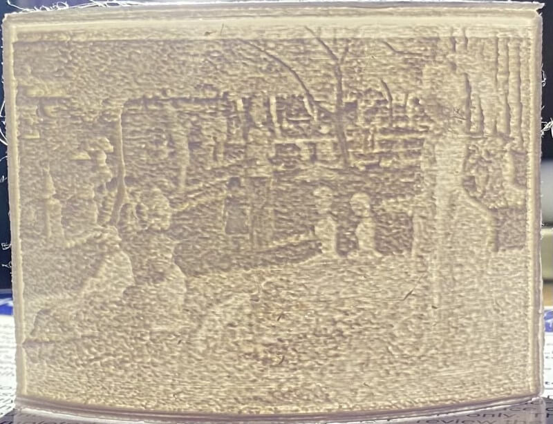

# Lithophane Experiments (Junior Year - 2021)

<!-- Compleation Badge

Done - https://img.shields.io/badge/progress-done!-success?style=flat-square
Pending - https://img.shields.io/badge/progress-pending%20completion-yellow?style=flat-square
Halted - https://img.shields.io/badge/progress-halted-critical?style=flat-square
Constantly Updating - https://img.shields.io/badge/progress-constantly%20updating-informational?style=flat-square
-->

<!--- Social Links

HTML Link Generator - https://www.websiteplanet.com/webtools/sharelink/

<a class="fb" title="Share on Facebook" href="FACEBOOK-URL"><i class="fab fa-facebook-square"></i></a>
<a class="twitter" title="Share on Twitter" href="TWITTER-URL"><i class="fab fa-twitter"></i></a>
<a class="pin" title="Share on Pinterest" href="PINTEREST-URL"><i class="fab fa-pinterest"></i></a>
<a class="ln" title="Share on LinkedIn" href="LINKEDIN-URL"><i class="fab fa-linkedin"></i></a>
<a class="email" title="Share via Email" href="EMAIL-URL"><i class="fas fa-paper-plane"></i></a>

-->

**1-2 minutes :material-book-open-page-variant:**

<a class="fb" title="Share on Facebook" href="https://www.facebook.com/sharer/sharer.php?u=https://teddywarner.org/Projects/LithophaneExperiments/"><i class="fab fa-facebook-square"></i></a>
<a class="twitter" title="Share on Twitter" href="https://twitter.com/intent/tweet?url=https://teddywarner.org/Projects/LithophaneExperiments/&text=Check%20Out%20this%20compilation%20of%20Litophanes%20on"><i class="fab fa-twitter"></i></a>
<a class="pin" title="Share on Pinterest" href="https://pinterest.com/pin/create/button/?url=https://teddywarner.org/Projects/LithophaneExperiments/&media=&description=Check%20Out%20this%20compilation%20of%20Litophanes%20on%20https://teddywarner.org/Projects/LithophaneExperiments/%20!"><i class="fab fa-pinterest"></i></i></a>
<a class="ln" title="Share on LinkedIn" href="https://www.linkedin.com/shareArticle?mini=true&url=https://teddywarner.org/Projects/LithophaneExperiments/"><i class="fab fa-linkedin"></i></i></a>
<a class="email" title="Share via Email" href="mailto:info@example.com?&subject=&cc=&bcc=&body=Check%20Out%20this%20compilation%20of%20Litophanes%20on%20https://teddywarner.org/Projects/LithophaneExperiments/"><i class="fas fa-paper-plane"></i></i></i></a>

A Lithophane is a piece of art made out of a thin translucent material designed to show an image in a "grisaille" color format when held up to light.[^1] 3D printers can be utilized to create some nice-looking lithophanes, a practice made easy with *3dp.rocks* lithophane generator, linked below. Due to their easy creation, I find lithophanes to be a nice medium to test slicer changes with, allowing for your time to be spent with the slicer settings, and not the file prep. 

!!! note "Note" 

    This page is not documentation on the lithophane making process, but more of a portfolio of some notable lithophanes I've printed since taking up this medium.

[3dp.rocks's Lithophane Generator :fontawesome-solid-globe-americas:](https://3dp.rocks/lithophane/){ .md-button .md-button--primary }

<iframe width="90%" height="495" src="https://www.youtube.com/embed/ZNlbl6uhqbI" title="YouTube video player" frameborder="0" allow="accelerometer; autoplay; clipboard-write; encrypted-media; gyroscope; picture-in-picture" allowfullscreen></iframe>

****

## People

{width="49.5%"}
{width="46.6%"}

{width="51.5%"}
{width="45.7%"}

{width="51.5%"}
{width="46.3%"}

{width="50%"}
{width="46.4%"}

{width="75%"}
{width="75%"}

{width="47.2%"}
{width="49.1%"}

{width="51.5%"}
{width="44.5%"}

{width="51%"}
{width="45%"}

## Art

{width="51%"}
{width="45%"}

{width="80%"}
{width="80%"}

{width="51.5%"}
{width="44.6%"}

<!-- begin wwww.htmlcommentbox.com -->
 
<a href="http://www.htmlcommentbox.com">Comment Form</a> is loading comments...

 <link rel="stylesheet" type="text/css" href="https://www.htmlcommentbox.com/static/skins/bootstrap/twitter-bootstrap.css?v=0" />
 
<!-- end www.htmlcommentbox.com -->

[^1]: https://en.wikipedia.org/wiki/Lithophane

*[FDM]: Fused Deposition Modeling
*[CNC]: Computerized Numerical Control
*[MPCNC]: Mostly Printed Computerized Numerical Control - https://docs.v1engineering.com/mpcnc/intro/
*[SSH]: Secure Shell
*[GPIO]: General-Purpose Input/Output
*[USB]: Universal Serial Bus
*[Baudrate]: Measurement of Symbol Rate
*[ETA]: Estimated Time of Arrival
*[GCode]: A software programming language used to control a CNC machine
*[Git]: Software for tracking changes in any set of files
*[GUI]: Graphical User Interface
*[Parametric]: Parametric design is a process based on algorithmic thinking that enables the expression of parameters and rules that, together, define, encode and clarify the relationship between design intent and design response.
*[ISO]: International Organization for Standardization
*[Kreg-Jig]: A Pocket-Hole Jig
*[UPDI]: Unified Program and Debug Interface
*[AVR]: A Family of microcontrollers developed since 1996 by Atmel
*[programmer]: A piece of electronic equipment that arranges written software to configure programmable non-volatile integrated circuits
*[jtag]: Joint Test Action Group
*[IDE]: Integrated Development Environment
*[Rx]: Receiving Signal
*[Tx]: Transmitting Signal
*[VCC]: Voltage Common Collector (+)
*[GND]: Ground / Common Drain (-)
*[IC]: Integrated Circuit
*[LED]: Light-Emitting Diode
*[Cap]: Capacitor
*[SPST]: Single Pole Single Throw Switch
*[SPDT]: Single Pole Double Throw Switch
*[DPST]: Double Pole Single Throw Switch
*[DPDT]: Double Pole Double Throw Switch
*[EEPROM]: Electrically Erasable Programmable Read-Only Memory