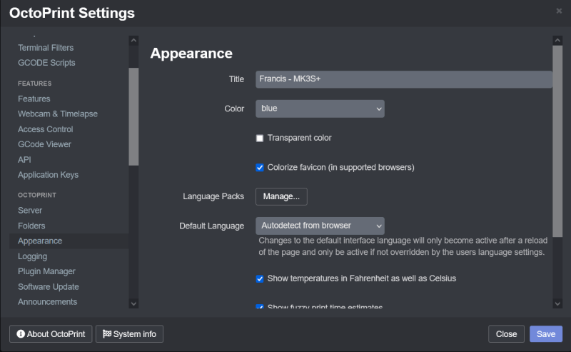
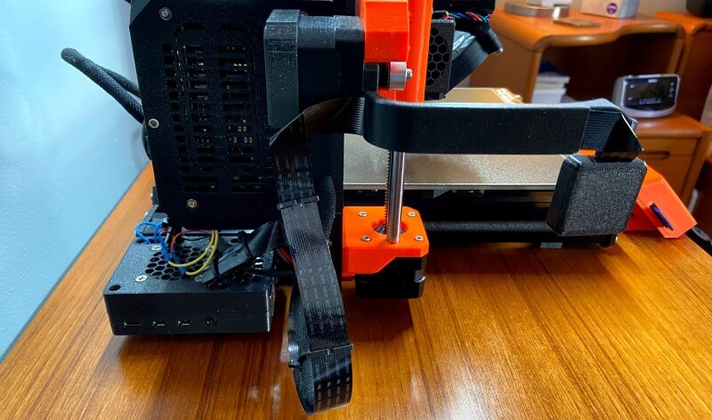
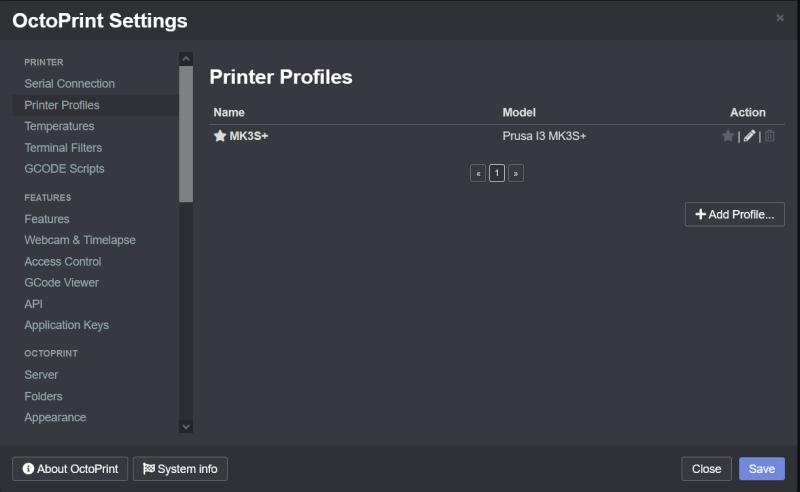
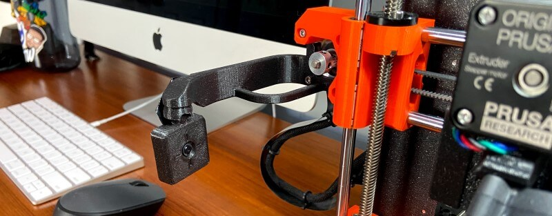
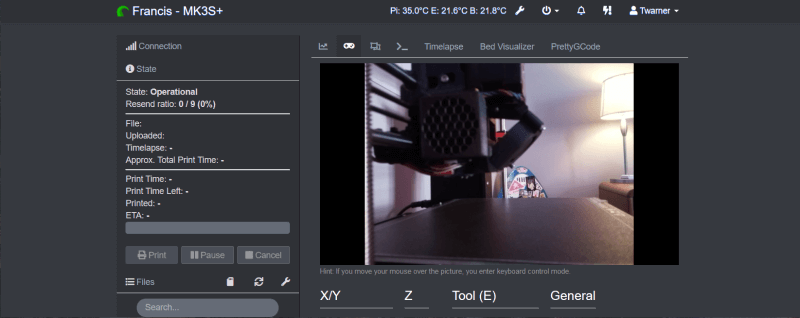
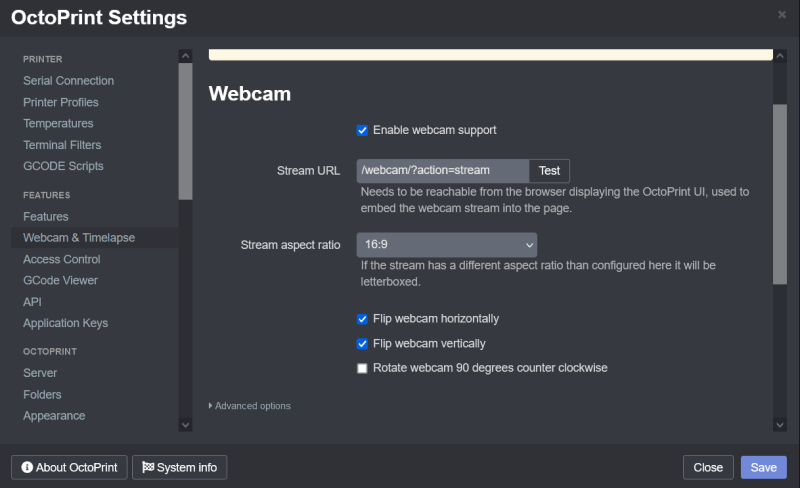
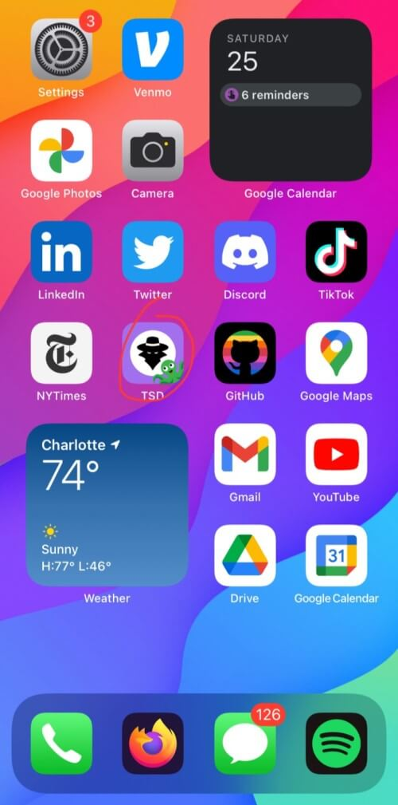
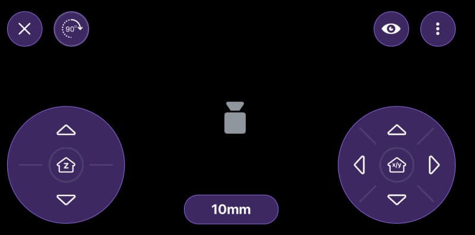
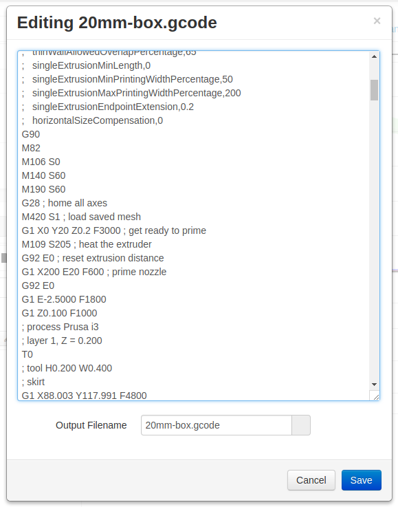
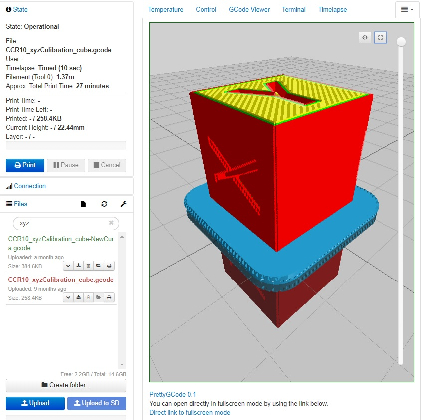

<script src="https://kit.fontawesome.com/79ff35ecec.js" crossorigin="anonymous"></script>

<style>

.share {
  float:right;
  margin-top: 0px;
  font-size: 1.1em;
}

.share a {
  color: inherit;
}

.twitter {
  padding-left: 0.2em;
  padding-right: 0.2em;
}

.fa-twitter:hover {
    color: #00acee;
}

.fb {
  padding-left: 0.2em;
  padding-right: 0.2em;
}

.fa-facebook-square:hover {
    color: #3b5998;
}

.pin {
  padding-left: 0.2em;
  padding-right: 0.2em;
}

.fa-pinterest:hover {
    color: 	#E60023;
}

.ln {
  padding-left: 0.2em;
  padding-right: 0.2em;
}

.fa-linkedin:hover {
    color: #0e76a8;
}

.email {
  padding-left: 0.2em;
  padding-right: 1.5em;
}

</style>

# Octoprint Setup Documentation 

<!-- Compleation Badge


Done - https://img.shields.io/badge/progress-done!-success?style=flat-square
Pending - https://img.shields.io/badge/progress-pending%20completion-yellow?style=flat-square
Halted - https://img.shields.io/badge/progress-halted-critical?style=flat-square
Constantly Updating - https://img.shields.io/badge/progress-constantly%20updating-informational?style=flat-square
-->


<!--- Social Links

HTML Link Generator - https://www.websiteplanet.com/webtools/sharelink/

<span class="share" style=" color: inherit;">
<a class="fb" title="Share on Facebook" href="FACEBOOK-URL"><i class="fab fa-facebook-square"></i></a>
<a class="twitter" title="Share on Twitter" href="TWITTER-URL"><i class="fab fa-twitter"></i></a>
<a class="pin" title="Share on Pinterest" href="PINTEREST-URL"><i class="fab fa-pinterest"></i></a>
<a class="ln" title="Share on LinkedIn" href="LINKEDIN-URL"><i class="fab fa-linkedin"></i></a>
<a class="email" title="Share via Email" href="EMAIL-URL"><i class="fas fa-paper-plane"></i></a>
</span>

-->

**9-11 minutes :material-book-open-page-variant:**
<span class="share" style=" color: inherit;">
<a class="fb" title="Share on Facebook" href="https://www.facebook.com/sharer/sharer.php?u=https://teddywarner.org/Projects/Octoprint/"><i class="fab fa-facebook-square"></i></a>
<a class="twitter" title="Share on Twitter" href="https://twitter.com/intent/tweet?url=https://teddywarner.org/Projects/Octoprint/&text=Setup%20an%20Instance%20of%20Octoprint%20for%20Your%20Machine%20With"><i class="fab fa-twitter"></i></a>
<a class="pin" title="Share on Pinterest" href="https://pinterest.com/pin/create/button/?url=https://teddywarner.org/Projects/Octoprint/&media=&description=Setup%20an%20Instance%20of%20Octoprint%20for%20Your%20Machine%20With%20https://teddywarner.org/Projects/Octoprint/"><i class="fab fa-pinterest"></i></a>
<a class="ln" title="Share on LinkedIn" href="https://www.linkedin.com/shareArticle?mini=true&url=https://teddywarner.org/Projects/Octoprint/"><i class="fab fa-linkedin"></i></a>
<a class="email" title="Share via Email" href="mailto:info@example.com?&subject=&cc=&bcc=&body=Setup%20an%20Instance%20of%20Octoprint%20for%20Your%20Machine%20With%20https://teddywarner.org/Projects/Octoprint/"><i class="fas fa-paper-plane"></i></a>
</span>

<center>

{width="100%"}

</center>

[Octoprint](https://octoprint.org/) takes 3D printing to new heights, creating a more concise workflow with more accessible machine control. The opensource [Octoprint project](https://github.com/OctoPrint/OctoPrint) was created and maintained by [Gina Häußge](https://octoprint.org/support-octoprint/). The software enables a machine with a web interface with full machine controls and a world of community plugins - all of which run on a Raspberry Pi made Server with an octoprint image. I use Octoprint on all of my personal printers, and a special CNC-focused fork of the software for my [MPCNC](https://www.v1engineering.com/). As mentioned above, web interfacing a machine creates a more concise workflow and thus is great for personal machines. However, an Octoprint setup shines even more in a print farm instance. During the winter months of my sophomore year (2020) I set up secure Octoprint instances on each of my lab's array of 20 FDM printers. Each of my setup instances can be read seen under the [My Octoprint Instances](https://teddywarner.org/Projects/Octoprint/#my-octoprint-instances) section of this page. 

## Octoprint Installation

To begin the [Octoprint](https://octoprint.org/) installation you'll need a Raspberry Pi *(Recommended hardware: Raspberry Pi 3B, 3B+ or 4B)*, a sufficient power source for the Pi, as well as a micro SD card *(4GB or larger)* to flash the Octorpint image to.

<center>

[Download the Latest Octopi Image :fontawesome-solid-download:](https://github.com/guysoft/OctoPi){ .md-button .md-button--primary }

</center>

First, download and flash the latest [Octoprint](https://octoprint.org/) image (linked above). This Pi image can be flashed as you would with any other Raspberry Pi project - I use [balenaEtcher](https://www.balena.io/etcher/) for flashing, its simple 3-step interface makes the process super straightforward. After a successful flash of this image on your Pi's SD card configure your WiFi information in the *octopi-wpa-supplicant.txt* located on the flashed SD card *(If you're using wired internet, you can skip this setup)*. To update the *octopi-wpa-supplicant.txt* file with your network, open the file in a code editor of your choice **- Do not use WordPad (Windows) or TextEdit (MacOS X) -** for this, as these editors will mess with the file layout, and cause problems with your setup. Next, locate the type of network you'll be connecting to - for this example, I'll be using the *WPA/WPA2 Secured* standard, 

```
## WPA/WPA2 secured
#network={
#  ssid="put SSID here"
#  psk="put password here"
#}
```

for any type of connection you choose, you can enable it by uncommenting the sections lines with a single hashtag, leaving you with a block like below.

```
## WPA/WPA2 secured
network={
  ssid="put SSID here"
  psk="put password here"
}
```

Next, replace the test *"put SSID here"* with your network's SSID, and repeat with the password line & your network's password.

Finally, scroll down to the bottom of the document to the section starting *"# Uncomment the country your Pi is in..."*. Here, remove the hashtag in front of your network's country, and add a hashtag in front of all other (non-selected) countries.

Then, after saving your file and ejecting your SD, you can install your flashed SD in your Pi and boot.

Next, some basic Pi config. Make sure you are on the same WiFi network you set up your Pi on, and then SSH into your booted Pi at the IP *octopi.local* with the Pi's default credentials (Username - *pi* / Password - *raspberry*). I use [Putty](https://www.putty.org/) as my SSH client as again, it's pretty straightforward to use. Once connected to your Pi, run the command ...

```
sudo raspi-config
```

to open the configuration GUI. Here you can change your Pi's credentials (highly recommended), set up your local timezone (to allow for accurate machine ETAs), and change your machine's hostname (thus changing the URL from the default *octopi.local* to *YOURHOSTNAME.local*). After all, changes, be sure to reboot your Pi.

Congrats! you have now installed [Octoprint](https://octoprint.org/) on your Raspberry Pi, and can now connect to its web server with the URL *http://octopi.local* ( or if you changed your hostname, with the URL *http://YOURHOSTNAME.local*).

## Octoprint Configuration

With an Octoprint instance up and running, the difficult part of the setup is complete. Access to the web interface allows for easy machine and interface setup, in addition to some more customizations in the form of community plug-ins.

### Interface Config

Beginning with the configuration of the interface itself, basic settings can be found in the web interface by clicking on the wrench icon on the right side of the navigation bar located at the top of the interface. Scrolling through these menus allows for total customization of the interface. A good starting place is under the *Octoprint* section in the *Appearance* menu. Here (as shown below) you can customize the interface title - displayed in the interface's navigation bar, as well as the default interface highlight color.

<center>

{width="95%"}

</center>

### Printer Setup

To enable Octoprint's main purpose, a machine must be connected to the hardware running Octoprint via serial. This connection can come in the form of a USB cable in the simplest setup, or GPIO pins can be used for communication as well. In the case of my personal Prusa I3 MK3S+, I took advantage of this GPIO communication setup, to allow for the mounting of my Raspberry Pi directly under my printer's mainboard (via [this](https://www.prusaprinters.org/prints/24475-remix-of-raspberry-pi-4-case-3030-hanging-mount-fo) Raspberry Pi 4 Case) without a bulky USB cable connecting them ...

<center>

{width="95%"}

</center>

Your serial connection must be set up software side in the *Serial Connection* menu found under the *Printer* section of the interface settings. Octoprint can automatically detect your *Serial Port* and *Baudrate* when *AUTO* is selected in these dropdowns, however, you may also specify specifics for each field. 

<center>

{width="95%"}

</center>

Next, a machine profile must be created for your connected machine to ensure safe machine control with regard to hardware limits. A profile can be created in the *Printer Profiles* menu under the *Printer* section of the interface's settings. Create a new profile by clicking the *Add Profile...* button in the lower right corner of the menu, and fill out the profile with your machine's information.

<center>

{width="95%"}

</center>

One key feature of Octoprint is its webcam machine stream, allowing for remote supervision of your machine. Anything from USB webcams to Raspberry Pi ribbon cable cameras can be used for this stream & Octoprint will automatically find this attached webcam and will use it to stream your machine (some more exotic cameras or mounting styles may require an additional configuration - discussed below). On my printer, I've mounted a Raspberry Pi camera to the X-Axis stepper of my machine (via [this](https://www.thingiverse.com/thing:3121052) Raspberry Pi camera mount), yielding a pretty nice side view of prints, shown below.

<center>

{width="95%"}
{width="95%"}

</center>

Due to this mount, my Raspberry Pi camera is heald in an upsidedown orientation and thus needs to be compensated for on the software side. Luckily, in the *Webcam & Timelapse* menu under the *Features* section of the Octorpitn interface settings, webcam orientation can be changed. In addition, more advanced webcam options can be found, allowing for the use of almost all cameras connected to the hardware running Octorpint.

<center>

{width="95%"}

</center>

### Plugins

One of the greatest features of Octorpint stems from its open-source nature ... its community plugins. Under the *Plugin Manager* menu in the *Octoprint* section of the interface's settings, plugins can be added to the octoprint instance, allowing for entire customization of the instance from the interface to machine interaction. There are tons upon tons of plugins that exist in the Octorpitn community, and you may even develop your own, however below is a list of plugins I find to be amazing additions to an instance (Note - some are machine specific to my Prusa I3 MK3S+) - 

<center>

{width="95%"}

</center>

 - Access Anywhere - The Spaghetti Detective - AI-powered failure detection & Remote Octoprint Access

 <center>

  {width="46%"}
  {width="47.5%"}

  {width="94%"}

  </center>

 - Bed Visualizer - Uses Plotly js library to render a 3D surface of the bed’s reported mesh
 
 <center>

  {width="95%"}

  </center>

 - Custom Background - Change the background image on the temperature graph
 <center>


  {width="95%"}

  </center>

 - Exclude Region - Adds the ability to prevent printing within rectangular or circular regions of the currently active gcode file 

 <center>

  {width="95%"}

  </center>

 - Floating Navbar - Make the navbar stick to the top of the page while scrolling
 - GcodeEditor - Edit gcode that's been uploaded to OctoPrint

 <center>

  {width="50%"}
  {width="46%"}

  </center>

 - Heater Timeout - Automatically shut off heaters if no print has been started
 - Navbar Temp - Display temperatures on the navbar

 <center>

  {width="60%"}

  </center>

 - Octoprint Display ETA - Show finish time (ETA) for current print

 <center>

  {width="300"}
  
  </center>

 - PrettyGCode - adds a 3D GCode visualizer tab in Octoprint

 <center>

  {width="75%"}

  </center>

 - Themeify - Beautiful themes for octoprint
 - ipOnConnect - Display the ip address of the connected OctoPrint instance on the control panel (MK3S+ specific)

 <center>

  {width="95%"}

  </center>

## Octoprint Interface Workflow

Although the Octoprint web interface is rather intuitive, the number of stock features (not to mention plugin-enabled ones) can be a bit overwhelming without a bit of exploring. Below is a short PowerPoint I put together walking through the basics of the interface for students using my lab print farm, allowing for a bit of knowledge before exploration.

<iframe src="https://docs.google.com/presentation/d/e/2PACX-1vR6_FehCcFtgrH6KYo5DuwZ3WEcFPoPesZBn_naPUVLJ-wylwF8p8eu6KqsSV9Zz71wESnbA-aIAoqa/embed?start=false&loop=false&delayms=5000" frameborder="0" width="100%" height="550" allowfullscreen="true" mozallowfullscreen="true" webkitallowfullscreen="true"></iframe>

## My Octoprint Instances

<center>

{width="95%"}
  <figcaption>My Personal Octoprint Enabled Prusa I3 MK3S+</figcaption>

{width="95%"}
  <figcaption>My Lab's Octoprint Enabled Printer Farm</figcaption>

</center>

<!-- begin wwww.htmlcommentbox.com -->
 <div id="HCB_comment_box"><a href="http://www.htmlcommentbox.com">Comment Form</a> is loading comments...</div>
 <link rel="stylesheet" type="text/css" href="https://www.htmlcommentbox.com/static/skins/bootstrap/twitter-bootstrap.css?v=0" />
 <script type="text/javascript" id="hcb"> /*<!--*/ if(!window.hcb_user){hcb_user={};} (function(){var s=document.createElement("script"), l=hcb_user.PAGE || (""+window.location).replace(/'/g,"%27"), h="https://www.htmlcommentbox.com";s.setAttribute("type","text/javascript");s.setAttribute("src", h+"/jread?page="+encodeURIComponent(l).replace("+","%2B")+"&mod=%241%24wq1rdBcg%24rC8CBT1V7ZoWek7B.CC5x."+"&opts=16798&num=10&ts=1634155475586");if (typeof s!="undefined") document.getElementsByTagName("head")[0].appendChild(s);})(); /*-->*/ </script>
<!-- end www.htmlcommentbox.com -->