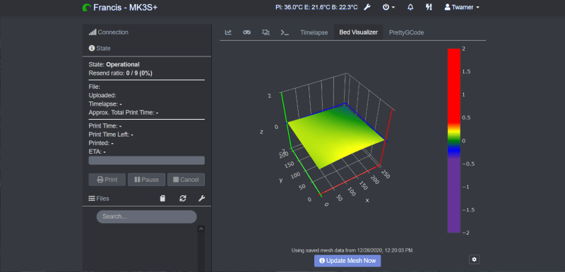
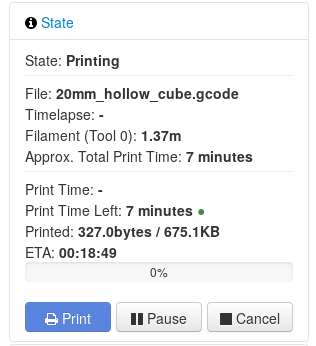
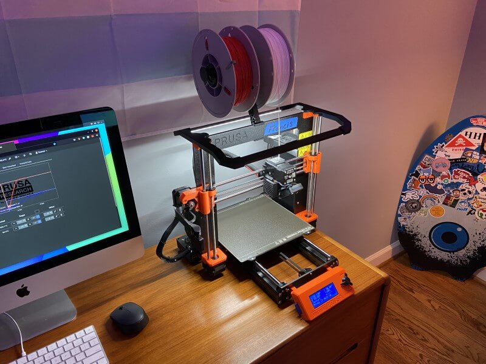

# Octoprint Setup Documentation 

<!-- Compleation Badge


Done - https://img.shields.io/badge/progress-done!-success?style=flat-square
Pending - https://img.shields.io/badge/progress-pending%20compleation-yellow?style=flat-square
Halted - https://img.shields.io/badge/progress-halted-critical?style=flat-square
Constantly Updating - https://img.shields.io/badge/progress-constantly%20updating-informational?style=flat-square
-->


**X-X minutes :octicons-book-16:**

<center>

{width="100%"}

</center>

[Octoprint Repo](https://github.com/OctoPrint/OctoPrint)

## Octoprint Instalation

To begin the Octoprint instalation youll need a Raspberry Pi *(Recommended hardware: Raspberry Pi 3B, 3B+ or 4B)*, a sufficent power source for the Pi, as well as a micro SD card *(4GB or larger)* to flash the Octorpint image to.

<center>

[Download the Latest Octopi Image](https://github.com/guysoft/OctoPi){ .md-button .md-button--primary }

</center>

First, download and flash the latest [Octoprint](https://octoprint.org/) image (linked above). This Pi image can be flashed as you would with any other Raspberry Pi project - I use [balenaEtcher](https://www.balena.io/etcher/) for flashing, its simple 3-step interface makes the process super straightforward. After a successful flash of this image on your Pi's SD card configure your WiFi information in the *octopi-wpa-supplicant.txt* located on the flashed SD card *(If you're using wired internet, you can skip this setup)*. To update the *octopi-wpa-supplicant.txt* file with your network, open the file in a code editor of your choice **- Do not use WordPad (Windows) or TextEdit (MacOS X) -** for this,as these editors will mess with the file layout, and cause probles with your setup. Next, locate the type of network you'll be connecting to - for this example, Ill be using the *WPA/WPA2 Secured* standard, 

```
## WPA/WPA2 secured
#network={
#  ssid="put SSID here"
#  psk="put password here"
#}
```

for any type of connection you choose, you can enable it by uncommnenting the sections lines with a single hashtag, leaving you with a block like below.

```
## WPA/WPA2 secured
network={
  ssid="put SSID here"
  psk="put password here"
}
```

Next, replace the test *"put SSID here"* with your networks SSID, and repeat with the passwork line & your networks password.

Finally, scroll down to the bottom of the document to the setion starting *"# Uncomment the country your Pi is in..."*. Here, remove the hashtag infront of your networks country, and add a hashtag infront of all other (non-selected) countrys.

Then, after saving your file and edjecting your SD, you can install your flashed SD in your Pi and boot.

Next, some basic Pi config. Make sure you are on the same WiFi network you set up your Pi on, and then SSH into your booted Pi at the IP *octopi.local* with the Pi's default credentials (Username - *pi* / Password - *raspberry*). I use [Putty](https://www.putty.org/) as my SSH client as again, it's pretty straightforward to use. Once connected to your Pi, run the command ...

```
sudo raspi-config
```

to open the configuration GUI. Here you can change your Pi's credentials (highly recommended), set up your local timezone (to allow for accurate machine ETAs), and change your machine's hostname (thus changing the URL from the default *octopi.local* to *YOURHOSTNAME.local*). After all changes, be sure to reboot your Pi.

Congrats! you have now installed [Octoprint](https://octoprint.org/) on your Raspberry Pi, and can now connect to its web server with the URL *http://octopi.local* ( or if you changed your hostname, with the URL *http://YOURHOSTNAME.local*).

## Octoprint Configuration

### Interface Config

<center>

{width="95%"}

</center>

### Hardware & Printer Setup

<center>

{width="95%"}

</center>

<center>

{width="95%"}
{width="95%"}

</center>

### Plugins

<center>

{width="95%"}

</center>

 - Access Anywhere - The Spaghetti Detective - AI-powered failure detection & Remote Octoprint Access

 <center>

  {width="46%"}
  {width="47.5%"}

  {width="94%"}

  </center>

 - Bed Visualizer - Uses Plotly js library to render a 3D surface of the bed’s reported mesh
 
 <center>

  {width="95%"}

  </center>

 - Custom Background - Change the background image on the temperature graph
 <center>


  {width="95%"}

  </center>

 - Exclude Region - Adds the ability to prevent printing within rectangular or circular regions of the currently active gcode file 

 <center>

  {width="95%"}

  </center>

 - Floating Navbar - Make the navbar stick to the top of the page while scrolling
 - GcodeEditor - Edit gcode that's been uploaded to OctoPrint

 <center>

  {width="50%"}
  {width="46%"}

  </center>

 - Heater Timeout - Automatically shut off heaters if no print has been started
 - Navbar Temp - Display temperatures on navbar

 <center>

  {width="60%"}

  </center>

 - Octoprint Display ETA - Show finish time (ETA) for current print

 <center>

  {width="300"}
  
  </center>

 - PrettyGCode - adds a 3D GCode visualizer tab in Octoprint

 <center>

  {width="75%"}

  </center>

 - Themeify - Beautiful themes for octoprint
 - ipOnConnect - Display the ip address of connected OctoPrint instance on the control panel 

 <center>

  {width="95%"}

  </center>

## Octoprint Interface Workflow

<iframe src="https://docs.google.com/presentation/d/e/2PACX-1vR6_FehCcFtgrH6KYo5DuwZ3WEcFPoPesZBn_naPUVLJ-wylwF8p8eu6KqsSV9Zz71wESnbA-aIAoqa/embed?start=false&loop=false&delayms=5000" frameborder="0" width="100%" height="550" allowfullscreen="true" mozallowfullscreen="true" webkitallowfullscreen="true"></iframe>

## My Octoprint Instances

<center>

{width="95%"}
  <figcaption>My Personal Octoprint Enabled Prusa I3 MK3S+</figcaption>

{width="95%"}
  <figcaption>My Lab's Octoprint Enabled Printer Farm</figcaption>

</center>