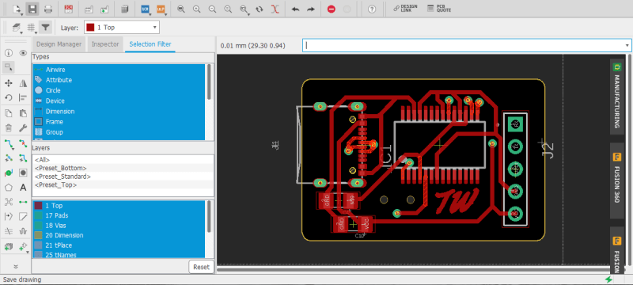
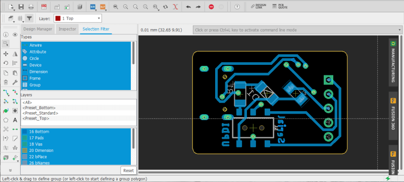
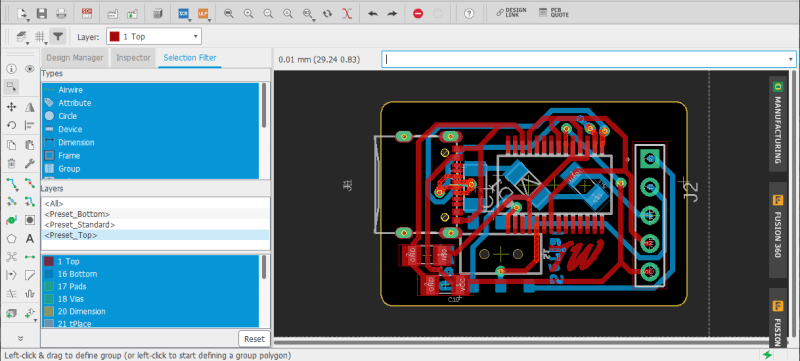

# USB-C UPDI Serial Programmer (Junior Year - 2021)

**X-X minutes :octicons-book-16:**

**NOTE - This project is still in the works, and this page is not yet complete**

Many modern small chipsets rely on the Unified Program and Debug Interface (UPDI), a one-wire interface allowing for the changing of fuzes, burning of bootloaders, or uploading of sketches to any AVR Dx-series parts or any modern [AVR Microcontrollers](https://www.microchip.com/en-us/products/microcontrollers-and-microprocessors/8-bit-mcus/avr-mcus). Due to their reliance on the Unified Program and Debug Interface, these parts cannot be programmed with classic ISP style programmers, and thus a UPDI enabled programmer is required. Although UPDI is the only programming option in the case of these parts, the one-wire interface is superior to the four-wire of a classic ISP programmer and allows for quicker programming setup and less cluttered boards due to fewer programming pins. This USB-C UPDI programmer is built with a [Ft232rl](https://ftdichip.com/products/ft232rl/) chip allowing for serial interfacing, and runs alongside the [megaTinyCore](https://github.com/SpenceKonde/megaTinyCore) library witch equips your IDE for serial UPDI programming via a portable python implementation.

## Programmer Manufacturing

I made countless PCBs during my cycle of the [Fab Academy](https://fabacademy.org/), one of the first being a tool to program the rest, an [In-Circuit Programmer](http://fabacademy.org/2021/labs/charlotte/students/theodore-warner/Assignments/week04/#in-circuit-programmer). Being one of the first boards I fabricated myself, from the PCB milling to soldering & stuffing, I hadn't yet taken up the practice of designing my boards, and for this assignment, fabricated the [In-Circuit Programmer](http://fabacademy.org/2021/labs/charlotte/students/theodore-warner/Assignments/week04/#in-circuit-programmer) design of one of my mentors, [Dr. Adam Harris](http://sheekgeek.org/). This board is a specialized Arduino-like board, running on an ATMega 328p with a programmer sketch provided by the [megaTinyCore](https://github.com/SpenceKonde/megaTinyCore) library. The [In-Circuit Programmer](http://fabacademy.org/2021/labs/charlotte/students/theodore-warner/Assignments/week04/#in-circuit-programmer) I fabricated in Fab Academy's operation is great, but due to new updates in the [megaTinyCore](https://github.com/SpenceKonde/megaTinyCore) library, the process can be optimized for faster speeds, and the board size and component requirements can be reduced. This board marks my first steps into the world of multi-layered PCB design and fabrication, a process I'm super pumped to pick up and apply to future projects.

### PCB Design

{width="100%"}
  <figcaption>First USB-C UPDI Programmer Schematic</figcaption>

{width="100%"}
{width="100%"}
{width="100%"}
  <figcaption>First USB-C UPDI Programmer Board File</figcaption>

### Fabrication & Testing

## Programmer Usage

Choose a Serial-UPDI option from the Tools -> Programmer menu of [megaTinyCore](https://github.com/SpenceKonde/megaTinyCore)

