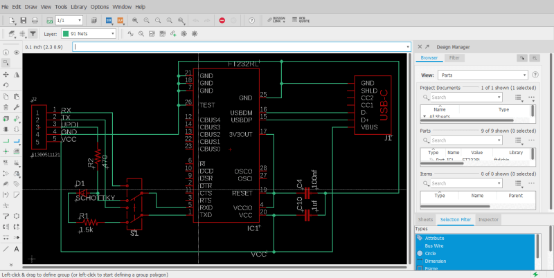

# USB-C UPDI Serial Programmer (Junior Year - 2021)

<!-- Compleation Badge


Done - https://img.shields.io/badge/progress-done!-success?style=flat-square
Pending - https://img.shields.io/badge/progress-pending%20compleation-yellow?style=flat-square
Halted - https://img.shields.io/badge/progress-halted-critical?style=flat-square
Constantly Updating - https://img.shields.io/badge/progress-constantly%20updating-informational?style=flat-square
-->


**X-X minutes :octicons-book-16:**

Many modern small chipsets rely on the Unified Program and Debug Interface (UPDI), a one-wire interface allowing for the changing of fuzes, burning of bootloaders, or uploading of sketches to any AVR Dx-series parts or any modern [AVR Microcontrollers](https://www.microchip.com/en-us/products/microcontrollers-and-microprocessors/8-bit-mcus/avr-mcus). Due to their reliance on the Unified Program and Debug Interface, these parts cannot be programmed with classic ISP style programmers, and thus a UPDI enabled programmer is required. Although UPDI is the only programming option in the case of these parts, the one-wire interface is superior to the four-wire of a classic ISP programmer and allows for quicker programming setup and less cluttered boards due to fewer programming pins. This USB-C UPDI programmer is built with a [Ft232rl](https://ftdichip.com/products/ft232rl/) chip allowing for serial interfacing, and runs alongside the [megaTinyCore](https://github.com/SpenceKonde/megaTinyCore) library witch equips your IDE for serial UPDI programming via a portable python implementation.

## [MegaTinyCore](https://github.com/SpenceKonde/megaTinyCore) Doccumentation

In short, the [megaTinyCore](https://github.com/SpenceKonde/megaTinyCore) library is "An Arduino core for the tinyAVR 0-series, 1-series, and now the 2-series"([MTC Gtihub](https://github.com/SpenceKonde/megaTinyCore)). The [megaTinyCore](https://github.com/SpenceKonde/megaTinyCore) project was created and maintiend by [SpenceKonde](https://github.com/SpenceKonde). As meantioned above, the library equips your IDE for UPDI programming via a portable python instalation and can be used alongside a handful of different programmer types. The USB-C UPDI Serial programmer doccuemntated alter on this page is currently the optomial choice out of these options due to its low componet requirement and faster speeds than other programmers. In addation to serial programmers, One can use a 328p based board as a programmer (i.e. an Arduino or any of its clones) via [megaTinyCore's](https://github.com/SpenceKonde/megaTinyCore) *jtag2updi* sketch, or a desginated microship programming board or and UPDI programming tool that milicks any listed above. [Dr. Adam Harris](http://sheekgeek.org/), a mentor of mine during my cycle of [Fab Academy](https://fabacademy.org/) has a [Simple Fab-jtag2UPDI Board](http://sheekgeek.org/2020/adamsheekgeek/simple-fab-jtag2updi-board) project where a 328p based board is uses alongside the jtag2UPDI sketch, and is a great option whencreationg your own In-Circuit programmer though the library. I manufactured this board during my [Electronics Production](https://fabacademy.org/2021/labs/charlotte/students/theodore-warner/Assignments/week04/) and continused to use it for the next 16 weeks of the course.

### Library Instalation

**Arduino 1.8.13 is recommended** for use with the [megaTinyCore](https://github.com/SpenceKonde/megaTinyCore) library

The library relies of a board package witch can be isntalled via the board manager witch can be installed with 3 simple stemps included below (provided from this instalation [page](https://github.com/SpenceKonde/megaTinyCore/blob/master/Installation.md)).

```
http://drazzy.com/package_drazzy.com_index.json
```
1. File -> Preferences, enter the above URL in "Additional Boards Manager URLs"
2. Tools -> Boards -> Boards Manager...
3. Select *megaTinyCore by Spence Konde* and click "Install". For best results, choose the most recent version.


### Serial Programming

### jtag2UPDI Programming


## Programmer Manufacturing

I made countless PCBs during my cycle of the [Fab Academy](https://fabacademy.org/), one of the first being a tool to program the rest, an [In-Circuit Programmer](http://fabacademy.org/2021/labs/charlotte/students/theodore-warner/Assignments/week04/#in-circuit-programmer). Being one of the first boards I fabricated myself, from the PCB milling to soldering & stuffing, I hadn't yet taken up the practice of designing my boards, and for this assignment, fabricated the [In-Circuit Programmer](http://fabacademy.org/2021/labs/charlotte/students/theodore-warner/Assignments/week04/#in-circuit-programmer) design of one of my mentors, [Dr. Adam Harris](http://sheekgeek.org/). This board is a specialized Arduino-like board, running on an ATMega 328p with a programmer sketch provided by the [megaTinyCore](https://github.com/SpenceKonde/megaTinyCore) library. The [In-Circuit Programmer](http://fabacademy.org/2021/labs/charlotte/students/theodore-warner/Assignments/week04/#in-circuit-programmer) I fabricated in Fab Academy's operation is great, but due to new updates in the [megaTinyCore](https://github.com/SpenceKonde/megaTinyCore) library, the process can be optimized for faster speeds, and the board size and component requirements can be reduced. This board marks my first steps into the world of multi-layered PCB design and fabrication, a process I'm super pumped to pick up and apply to future projects.

### PCB Design

<center>

{width="100%"}
  <figcaption>First USB-C UPDI Programmer Schematic</figcaption>

{width="100%"}
{width="100%"}
{width="100%"}
  <figcaption>First USB-C UPDI Programmer Board File</figcaption>

</center>

### Fabrication & Testing

[PCB Rivets](http://fab.cba.mit.edu/classes/863.16/doc/tutorials/PCB_Rivets/)

## Programmer Usage

Choose a Serial-UPDI option from the Tools -> Programmer menu of [megaTinyCore](https://github.com/SpenceKonde/megaTinyCore)

