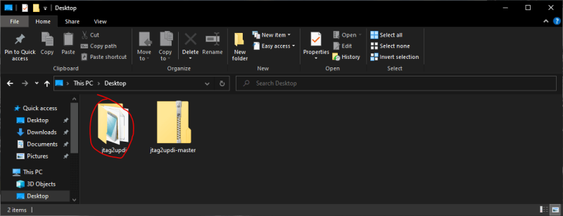
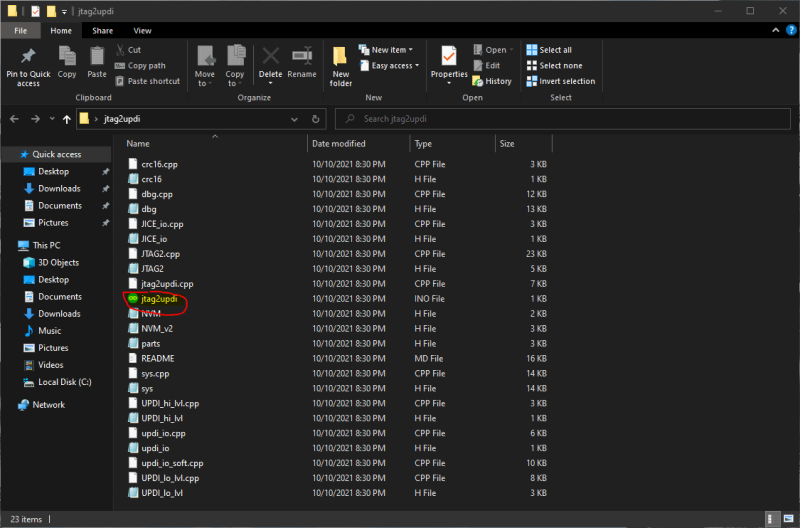
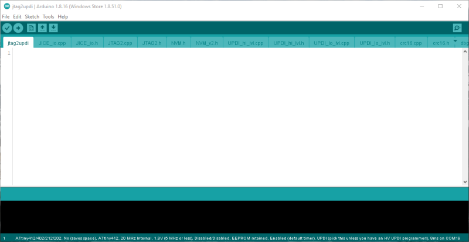
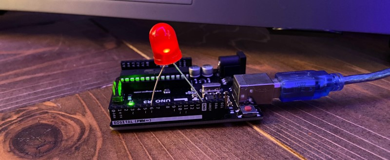

# USB-C UPDI Serial Programmer (Junior Year - 2021)

<!-- Compleation Badge


Done - https://img.shields.io/badge/progress-done!-success?style=flat-square
Pending - https://img.shields.io/badge/progress-pending%20completion-yellow?style=flat-square
Halted - https://img.shields.io/badge/progress-halted-critical?style=flat-square
Constantly Updating - https://img.shields.io/badge/progress-constantly%20updating-informational?style=flat-square
-->


**X-X minutes :octicons-book-16:**

Many modern small chipsets rely on the Unified Program and Debug Interface (UPDI), a one-wire interface allowing for the changing of fuzes, burning of bootloaders, or uploading of sketches to any AVR Dx-series parts or any modern [AVR Microcontrollers](https://www.microchip.com/en-us/products/microcontrollers-and-microprocessors/8-bit-mcus/avr-mcus). Due to their reliance on the Unified Program and Debug Interface, these parts cannot be programmed with classic ISP style programmers, and thus a UPDI enabled programmer is required. Although UPDI is the only programming option in the case of these parts, the one-wire interface is superior to the four-wire of a classic ISP programmer and allows for quicker programming setup and less cluttered boards due to fewer programming pins. This USB-C UPDI programmer is built with a [Ft232rl](https://ftdichip.com/products/ft232rl/) chip allowing for serial interfacing, and runs alongside the [megaTinyCore](https://github.com/SpenceKonde/megaTinyCore) library witch equips your IDE for serial UPDI programming via a portable python implementation.

## [MegaTinyCore](https://github.com/SpenceKonde/megaTinyCore) Documentation

In short, the [megaTinyCore](https://github.com/SpenceKonde/megaTinyCore) library is "An Arduino core for the tinyAVR 0-series, 1-series, and now the 2-series"([mTC Gtihub](https://github.com/SpenceKonde/megaTinyCore)). The [megaTinyCore](https://github.com/SpenceKonde/megaTinyCore) project was created and maintained by [SpenceKonde](https://github.com/SpenceKonde). As mentioned above, the library equips your IDE for UPDI programming via a portable python installation and can be used alongside a handful of different programmer types. The USB-C UPDI Serial programmer documented alter on this page is currently the optimal choice out of these options due to its low component requirement and faster speeds than other programmers. In addition to serial programmers, One can use a 328p based board as a programmer (i.e. an Arduino or any of its clones) via [megaTinyCore's](https://github.com/SpenceKonde/megaTinyCore) *jtag2updi* sketch, or a designated microchip programming board or and UPDI programming tool that mimicks any listed above. [Dr. Adam Harris](http://sheekgeek.org/), a mentor of mine during my cycle of [Fab Academy](https://fabacademy.org/) has a [Simple Fab-jtag2UPDI Board](http://sheekgeek.org/2020/adamsheekgeek/simple-fab-jtag2updi-board) project where a 328p based board is used alongside the jtag2UPDI sketch and is a great option when creating an In-Circuit programmer though the library. I manufactured this board during my [Electronics Production](https://fabacademy.org/2021/labs/charlotte/students/theodore-warner/Assignments/week04/) and continued to use it for the next 16 weeks of the course.

### Package Installation

**Arduino 1.8.13 is recommended** for use with the [megaTinyCore](https://github.com/SpenceKonde/megaTinyCore) library

Recent updates to the [megaTinyCore](https://github.com/SpenceKonde/megaTinyCore) library have simplified the installation process significantly. The library relies upon a board package that can be installed via the board manager witch can be installed with 3 simple steps included below (provided from this installation [page](https://github.com/SpenceKonde/megaTinyCore/blob/master/Installation.md)).

```
http://drazzy.com/package_drazzy.com_index.json
```
1. File -> Preferences, enter the above URL in "Additional Boards Manager URLs"
2. Tools -> Boards -> Boards Manager...
3. Select *megaTinyCore by Spence Konde* and click "Install". For best results, choose the most recent version.

### jtag2UPDI Programming

<center>

[Download the Latest jtag2udpi Sketch](https://github.com/SpenceKonde/jtag2updi){ .md-button .md-button--primary }

</center>

As mentioned prior, *jtag2updi* is a sketch from the [megaTinyCore](https://github.com/SpenceKonde/megaTinyCore) library, allowing for the use of a 328p-based board (i.e. Arduino or a clone) as an In-Circuit programmer. To begin with, this programming approach, download the latest version of the *jtag2udpi* sketch via the button above (Code -> *Download Zip*).

Extract the contents of this downloaded sketch folder by first unzipping the downloaded folder and next moving the contained sketch folder in the unzipped folder to a separate location. Finally, **Rename this sketch folder to *jtag2updi***, leaving you with a folder similar to the one circled in red in the image below.

<center>

{width="95%"}

</center>

Inside of this *jtag2updi* folder, navigate to the *jtag2UPDI.ino* project - circled and highlighted below - and open it in your IDE. 

<center>

{width="95%"}

</center>

This will open the *jtag2updi* project file system, leaving you with a blank *jtag2updi* sketch followed by multiple file tabs in your IDE (like shown in the picture below).

<center>

{width="95%"}

</center>

You can next upload this sketch to your 328p-based board of choice as you would any other sketch. As a first test to confirm the successful upload of this sketch to your board, hook up an LED to pin 6 of the board. If the board is successfully programmed, the LED will be dimly lit as shown below. **This simple test eliminates a potential error while troubleshooting a project, and confirms the programmer's working condition.**

<center>

{width="95%"}

</center>

Once a board is programmed with the *jtag2updi* project, it will act as a programmer until the next sketch is uploaded, unless the board's reset line is cut.

#### jtag2UPDI Usage

To make use of a *jtag2updi* enabled In-Circuit programmer board, prepare a sketch in your IDE to upload to your desired board. For documentation purposes, I'll be uploading the simple blink sketch included below to a super simple ATtiny 412 based LED board I made in [week 4](https://fabacademy.org/2021/labs/charlotte/students/theodore-warner/Assignments/week04/#blinky-test-board) of my Fab Academy cycle and documenting it for use with the Arduino IDE.

```
void setup() {
  pinMode(0, OUTPUT);
}

void loop() {
  digitalWrite(0, HIGH); 
  delay(500);
  digitalWrite(0, LOW); 
  delay(500); 
}
```

To upload code to your board via your *jtag2updi* enabled In-Circuit programmer board ...

 1. Wire your board to your *jtag2updi* In-Circuit Programmer board - UPDI pin of the board to pin 6 of *jtag2updi* In-Circuit Programmer board with an inline 100-470 ohm resistor running between the UPDI pin and the In-Circuit Programmer, VCC to VCC, and GND to GND
 2. Under the *Tools* menu in the Arduino IDE, change your board to your board's chipset by navigating to the *megaTinyCore* board menu via *Tools -> Board -> megaTinyCore* and then selecting your chip group from the list. 
 3. Next, specify your chip type under the *Chip* menu via *Tools -> Chip*. 
 4. For use with you *jtag2updi* In-Circuit Programmer board, change the programmer option to *Tools–>Programmer –> jtag2updi*
 5. Change your COM port to connect via serial to your In-Circuit Programmer board if not already connected
 6. Finally, upload your sketch via the ***Upload Using Programmer*** button found under the IDE's *Sketch* menu - Not with the normal upload button (this will override your programmers *jtag2updi* sketch if done).

Following these steps on my simple ATtiny 412 board yielded the 1/2 second blink example below. 

<iframe width="100%" height="500" src="https://www.youtube.com/embed/vvL9G3BIThU" title="YouTube video player" frameborder="0" allow="accelerometer; autoplay; clipboard-write; encrypted-media; gyroscope; picture-in-picture" allowfullscreen></iframe>

**Congrats!** you can now program any modern [AVR Microcontrollers](https://www.microchip.com/en-us/products/microcontrollers-and-microprocessors/8-bit-mcus/avr-mcus) via UPDI and a *jtag2updi* enabled 328p-based board.

### Serial Programming

Version 2.2.0 of the [megaTinyCore](https://github.com/SpenceKonde/megaTinyCore) library brings the implementation of a portable python implementation. This instalation, based on [pymcuprog](https://pypi.org/project/pymcuprog/), **allows for a programming speed increase by a factor of 20** when compared to the prior *jtag2udpi* programming style. With this preformance increase in addation to a smaller & cheaper hardware list, Serial UDPI programming with the [megaTinyCore](https://github.com/SpenceKonde/megaTinyCore) library is the most optomial form of programming I've used on my boards to date.

The serial programming style relies on this prior meantioned portabel python instalation alonside a USB-Serial adapter acting as the programmer in this case. Though this section of the page will documente this programming style via a pre-made USB-Serial adapter (in this case an FTDI chip) and some other hardware bits, please note the [USB-C UPDI Serial Progrmmaer](https://teddywarner.org/Projects/SerialUPDI/#usb-c-updi-programmer-manufacturing) board documented later on this page - this board is a set hardware peice for this Serial UPDI programming style, and provides a perminate hardware programming board. To engage the Serial UPDI programming method without a board like this you'll need the required hardware...

 1. A USB-Serial Adapter - I'll be using an FTDI FT232 for this documentation, but boards based on the CH340G or the CP210 chips work great aswell
 2. Some Jumper Wires
 3. A Schottky Diode
 4. A *470 ohm* Resistor - If creating a UPDI progtrammable board, incoperate this resistor into your schematic using the pinout below, running the 470 resistor inline to the UPDI pin. 

```
      __________________
-----| UPDI---\/\/------>
-----| Gnd    470 ohm (100 ~ 1k)
-----| Vcc
     |__________________
```

If not creating your own board, and theres no inline UPDI resistor (470 ohm isnt mandatory - anything between 100 ~ 1k ohm will do fine) you'll need to include this resistor extarnly. With that said, wireing between your serial adapter and the target device is diagrammed in the schematicxs below.

 - VCC of Adapter to VCC of Target
 - GND of Adapter to GND of Target
 - Schottky Diode between the Rx & Tx of Serial Adapter (Cathode to Tx)
 - Rx of Adapter to UPDI of Target - Here include the *470 ohm* resistor as needed 

**Ideal - internal resistor in adapter - not more than 1k**

```
--------------------                                 To Target device
                DTR|                                  __________________
    internal    Rx |--------------,------------------| UPDI---\/\/------>
  Tx---/\/\/\---Tx |-------|<|---'          .--------| Gnd    470 ohm (100 ~ 1k)
    resistor    Vcc|---------------------------------| Vcc
  typ. 1k       CTS|                     .`          |__________________
                Gnd|--------------------'             If you make a 3-pin connector, use this pinout
--------------------

or

--------------------                                 To Target device
                DTR|      External 470 ohm (100 ~ 1k) __________________
    internal    Rx |--------------,--\/\/------------| UPDI------------->
  Tx---/\/\/\---Tx |-------|<|---'          .--------| Gnd
    resistor    Vcc|---------------------------------| Vcc
  typ 1k        CTS|                     .`          |__________________
                Gnd|--------------------'
--------------------
```

**Or with no internal resistor on adapter - as long as target has one**

```
--------------------                                 To Target device
                DTR|                                  __________________
       no       Rx |--------------,------------------| UPDI---\/\/------>
    internal    Tx |-------|<|---'          .--------| Gnd    470 ohm (100 ~ 1k)
    resistor    Vcc|---------------------------------| Vcc
                CTS|                     .`          |__________________
                Gnd|--------------------'
--------------------
```


#### Serial Programmer Usage


**Note that this does not give you serial monitor - you need to connect a serial adapter the normal way for that**

## USB-C UPDI Programmer Manufacturing

I made countless PCBs during my cycle of the [Fab Academy](https://fabacademy.org/), one of the first being a tool to program the rest, an [In-Circuit Programmer](http://fabacademy.org/2021/labs/charlotte/students/theodore-warner/Assignments/week04/#in-circuit-programmer). Being one of the first boards I fabricated myself, from the PCB milling to soldering & stuffing, I hadn't yet taken up the practice of designing my boards, and for this assignment, fabricated the [In-Circuit Programmer](http://fabacademy.org/2021/labs/charlotte/students/theodore-warner/Assignments/week04/#in-circuit-programmer) design of one of my mentors, [Dr. Adam Harris](http://sheekgeek.org/). This board is a specialized Arduino-like board, running on an ATMega 328p with a programmer sketch provided by the [megaTinyCore](https://github.com/SpenceKonde/megaTinyCore) library. The [In-Circuit Programmer](http://fabacademy.org/2021/labs/charlotte/students/theodore-warner/Assignments/week04/#in-circuit-programmer) I fabricated in Fab Academy's operation is great, but due to new updates in the [megaTinyCore](https://github.com/SpenceKonde/megaTinyCore) library, the process can be optimized for faster speeds, and the board size and component requirements can be reduced. This board marks my first steps into the world of multi-layered PCB design and fabrication, a process I'm super pumped to pick up and apply to future projects.

### PCB Design

<center>

{width="100%"}
  <figcaption>First USB-C UPDI Programmer Schematic</figcaption>

{width="100%"}
{width="100%"}
{width="100%"}
  <figcaption>First USB-C UPDI Programmer Board File</figcaption>

</center>

### Fabrication & Testing

[PCB Rivets](http://fab.cba.mit.edu/classes/863.16/doc/tutorials/PCB_Rivets/)

## Programmer Usage

<!-- begin wwww.htmlcommentbox.com -->
 <div id="HCB_comment_box"><a href="http://www.htmlcommentbox.com">Comment Form</a> is loading comments...</div>
 <link rel="stylesheet" type="text/css" href="https://www.htmlcommentbox.com/static/skins/bootstrap/twitter-bootstrap.css?v=0" />
 <script type="text/javascript" id="hcb"> /*<!--*/ if(!window.hcb_user){hcb_user={};} (function(){var s=document.createElement("script"), l=hcb_user.PAGE || (""+window.location).replace(/'/g,"%27"), h="https://www.htmlcommentbox.com";s.setAttribute("type","text/javascript");s.setAttribute("src", h+"/jread?page="+encodeURIComponent(l).replace("+","%2B")+"&mod=%241%24wq1rdBcg%24rC8CBT1V7ZoWek7B.CC5x."+"&opts=16798&num=10&ts=1634155475586");if (typeof s!="undefined") document.getElementsByTagName("head")[0].appendChild(s);})(); /*-->*/ </script>
<!-- end www.htmlcommentbox.com -->